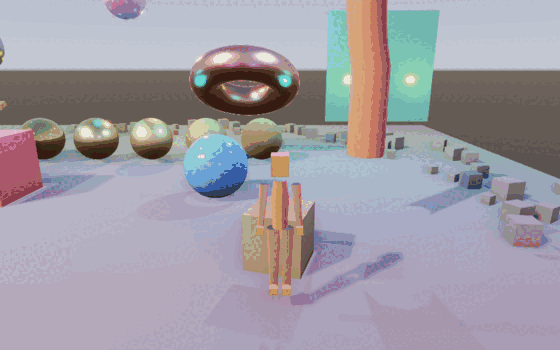
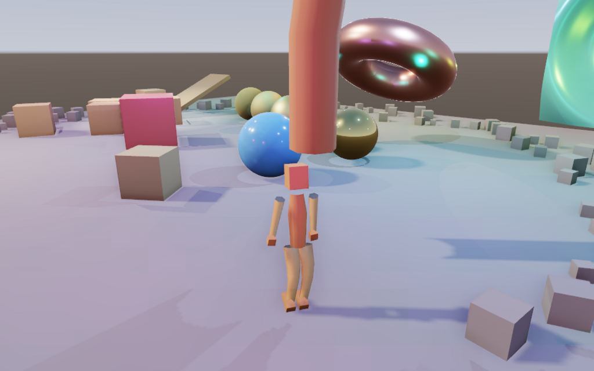
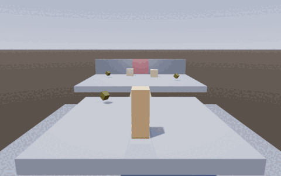
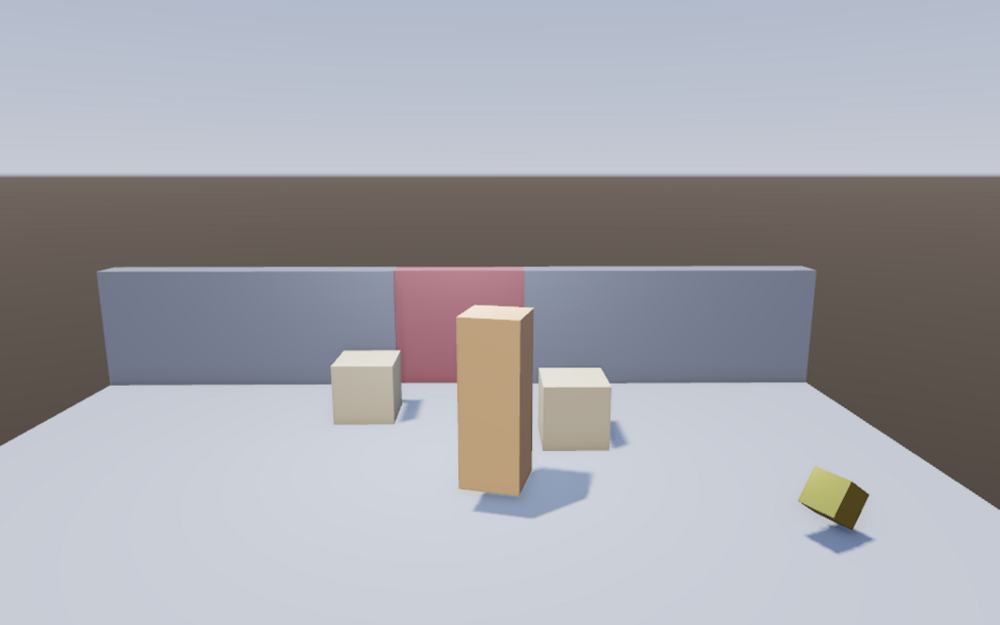

# Enchanted Graphics Engine

A Vulkan game engine in C++17, built from the renderer up.
[`docs/ROADMAP.md`](docs/ROADMAP.md) records how it got here, and §11 of it
is the road to v1.0 - the milestones between this and an engine someone
ships a small game with.


A Vulkan 1.3 forward renderer — dynamic rendering, a frame graph, a
metallic-roughness PBR pipeline with image-based lighting, shading into a
linear HDR target with an ACES tonemap pass — plus an entity-component
system, runtime reflection, textures with mip generation, a job system, a
fixed-timestep simulation clock and rigid-body physics.

The image above is the demo scene: five metal spheres sweeping roughness from
near-mirror to fully rough, plus two dielectrics, lit by a low sun under a
procedurally generated evening sky, three lights composing the shot, a bank
of forty short-range accent lights over the floor and a spot aimed down at
the crate tower. The smoothest metal reflects that sky — in earlier builds it was nearly black, because a mirror
with no environment to reflect *is* nearly black, and giving it one is
exactly what image-based lighting does. The sun casts real shadows through
depth-only frame graph passes — four cascades fitted to the camera's own
frustum, so the texels follow the viewer rather than the scene's bounding
box — and its direction, the disk in the sky and the shadows all agree
because they share one definition. Point lights cast shadows too, each
through a cube covering the whole sphere around it: six depth passes into
six layers of one image, sampled by direction so the hardware picks the face
and filters across the seams. A spot light over the crate tower casts through
a single map, which is all a cone with one direction and a bounded angle
needs — the cheapest of the three kinds of shadow the engine now has.

The environment, its irradiance and prefiltered specular convolutions and the
BRDF lookup table are all computed on the GPU at startup, so a clean checkout
still ships no binary assets.

Those forty-odd lights are not a stress test the renderer barely survives —
they are there because light count stopped being the thing that costs.
Shading is **clustered**: the view frustum is diced into a grid of cells, a
compute pass assigns every light to the cells its volume reaches, and a
fragment loops only the lights in its own cell. What a pixel pays for is how
many lights actually reach it, not how many the scene contains. The forward
shader this replaced looped every light for every fragment, which is why the
scene used to be capped at sixteen.

Scenes save and load as reflection-driven JSON, entities can be parented, and
draws are frustum-culled and sorted by material. Render passes declare what
they read and write; barriers, image layouts, transient render targets and
transient buffers are derived by the frame graph rather than written by hand —
including the compute-to-fragment dependency the light lists need.

The scene is rasterised at four coverage samples a pixel and averaged back
down as the attachment is stored, so geometry edges are smooth rather than
staircased. A device that cannot manage it says so and the renderer runs
single-sampled instead.

Depth goes down first, in a pass that writes nothing else, and the shading
pass then tests `EQUAL` with depth writes off — so the clustered fragment
shader, which samples four environment maps and walks a whole cluster of
lights, runs once per visible pixel rather than once per layer of geometry
standing over it. Both passes compute the vertex position from the same
shared expression and both declare `invariant gl_Position`, because a
comparison for exact equality against depth written by a different
calculation is a comparison that fails.

That depth is then read twice more. **Screen-space ambient occlusion**
samples the hemisphere over each surface and darkens the image-based ambient
where a point cannot see much of its surroundings, which is what makes an
object read as touching the floor rather than hovering over it; only the
ambient term, because a direct light either reaches a point or is stopped by
a shadow map that already knows. And a **depth pyramid** is built from it,
for occlusion culling that runs **entirely on the GPU, in the same frame it
decides about**. The frame is two-phase: an early compute pass compacts into
the depth pass's draws whatever was visible last frame, the pyramid is built
from that partial depth, and a late pass tests every candidate against it —
writing the instance counts the indirect draws consume, and appending
anything newly visible to a second set of draws in the same frame. Nothing
is copied back, and nothing pops in after a camera move: an object the early
pass wrongly skipped is caught by the late pass against real depth before
the frame is shaded. The scene has one standing thing for it to decide
about — a sphere directly behind the rippling sheet, which stops costing
anything while the sheet covers it and is back the moment the camera can
see past the edge.

Bright highlights bloom through a half-resolution blur chain, composited in
linear light before the ACES tonemap.

The copper torus is a **glTF import**: any `.gltf`/`.glb` dropped into
`assets/models/` is parsed, its materials and textures built, and its node
hierarchy spawned as entities at startup. The demo's torus is itself a
self-contained text glTF, so the no-binary-assets rule still holds.

The green sheet has no mesh file at all. Its 2 401 vertices are rewritten by a
C++ behaviour every tick and uploaded once a frame — geometry as a script's
output rather than as an asset.

The crate tower is **physics**: each crate is an entity with a `BoxCollider`
and a `RigidBody`, a steel boulder hangs over it, and pressing Play is what
drops it. Where the crates end up is the simulation's answer, not an authored
pose — and Stop restores the tower, because play mode's snapshot contract
applies to physics like everything else.

## The demo

```sh
./build/default/bin/EnchantedEngine --demo
```


A scripted camera move through the scene with the editor hidden and the scene
playing. Most of what a renderer does only becomes visible when the camera
moves: a mirror sphere is a coloured ball until its reflection slides across
it, and a shadow is a dark patch until it swings.
[`docs/DEMO.md`](docs/DEMO.md) says what each shot is aimed at. The engine
records its own frames — `--record DIR` writes every one as a PNG, with time
advancing a fixed step per frame so the same recording is the same on any
machine.

## Somebody in it

```sh
./build/default/bin/EnchantedEngine --demo --follow      # watch
./build/default/bin/EnchantedEngine --play               # or play it
```



A rigged figure, skinned on the GPU, walking on physics geometry with the
camera behind it. It is 370 vertices on nineteen joints with four clips —
idle, walk, run, jump — and it is a **text glTF in `assets/models/`**, like
everything else here: a clean checkout ships no binary assets.

Nothing is driving it by hand in that recording. A `Patrol` behaviour walks it
between the corners of a rectangle and jumps when it arrives, writing the same
four intent fields — `move`, `run`, `jump`, `jumpHeld` — that a player's hands
write through `PlayerCharacter`. The controller cannot tell them apart, which
is exactly why the recording is reproducible: run it again and you get the
same walk. Swap `--follow` for `--play` and the fields come from a keyboard or
a controller instead.

What is on screen is four subsystems agreeing. The **character controller**
holds the capsule upright and decides its velocity; **physics** finds out how
far that velocity gets and shoves the crate; the **animation system** picks a
clip from `grounded` and `planarSpeed` and crossfades into it; and the
**renderer** skins it through a depth pre-pass, an `EQUAL` depth test and
GPU-driven indirect draws without any of them knowing a character exists.



[`scripts/record_character_demo.sh`](scripts/record_character_demo.sh) records
both pictures.

## The game

```sh
./build/default/bin/EnchantedEngine --scene assets/scenes/level.egescene --play
```



A small level with a way to win and a way to lose. **Every rule in it lives in
`sandbox/`** — the project's own module, loaded at runtime — and the engine
knows nothing about coins, lives or gates.

### How it plays

You start on a platform with a coin on it and a gap in front of you. A narrow
bridge crosses the gap; missing it costs a life, and the level puts you back at
the start. Beyond the gap is a hall with two more coins, some crates in the
way, and a gate you cannot pass. **Take all three coins and the gate sinks into
the floor.** Through it is the exit pad, and standing on it ends the level.

| | |
|---|---|
| **Goal** | Collect three coins, then reach the exit pad. |
| **Obstacles** | A pit with a narrow bridge over it; crates to push aside; a gate that will not open until you have earned it. |
| **Fail state** | Falling into the pit. Three lives; the third one ends the level. |
| **Controls** | `WASD` or the left stick to move, mouse or right stick to look, `Space` to jump, `Shift` to run. |

The recording above is nobody's hands: a `ScriptedRun` behaviour walks a route
by writing the same intent fields a player writes, **and stands down the moment
a human touches anything**. That is why one scene file is both the reproducible
recording and the thing you play — press a key during the run and the level is
yours.

It steps into the pit on purpose, once. A recording that only ever shows the
winning line is a recording of a corridor; what makes this a game is that there
is a way to lose.



### How it is built

Seven behaviours, none of which knows what the others are:

| Behaviour | What it knows |
|---|---|
| `Collectible` | It was walked into, so it says so and removes itself. Not that anything is counting. |
| `Pit` | Something of the player's layer reached it, so it says so. Not what that costs. |
| `RespawnOnFall` | Falling means going back to the start, after a beat. Not why you fell. |
| `LevelRules` | Three coins open the gate and three falls end the level. The only thing that knows there *is* a level. |
| `GateSlides` | The gate opens, so it moves. It has never heard of a coin. |
| `ExitPad` | The gate is open and somebody stood here, so the level is over. |
| `ScriptedRun` | A route, and how to give it up when a human takes over. |

They are wired together by **events** rather than by pointers, which is what
lets each one be written without the others existing. The beat between the last
coin and the celebration is a **timer**, so it is the same length of simulated
time however fast the machine renders. The level itself is a **scene file** —
`assets/scenes/level.egescene`, written by
[`scripts/make_level.py`](scripts/make_level.py), which is the level editor
until there is a level editor.

Building it needed two changes to the engine, and it is worth being precise
that neither was gameplay: the primitives the engine ships had to be catalogued
before a scene is loaded rather than while one is built, and there had to be a
`--scene` to open a file with. Everything else was already there.

[`scripts/record_level.sh`](scripts/record_level.sh) records both pictures.

## The engine, being used

```sh
./build/default/bin/EnchantedEngine --demo --editor --size 1280 800
```


The last third of the same tour with the editor left up, which is the engine
rather than the picture it makes. Watch the **stats** panel: 139 candidates
every frame, most of them rejected by the frustum, a few more by the depth
pyramid, and what survives going out in a fraction as many draw calls because
the gravel shares a mesh and a material.

Partway through, the pink sphere's breathing suddenly deepens. Nothing
restarted: `sandbox/SandboxBehaviors.cpp` was edited and its module rebuilt
while the engine ran, the engine noticed the file, loaded the new one and
rebuilt every live behaviour from it. The console says so as it happens. The
inspector is showing `sandbox::Pulse` — a behaviour the engine was not built
with, drawn from reflection the engine learned about when the module loaded.
[`scripts/record_engine_demo.sh`](scripts/record_engine_demo.sh) records the
whole thing, edit and all.

The frame time in that panel is the recording machine's, and the recording
machine has no GPU: this is **lavapipe**, Mesa's software rasteriser, running
a 1280×800 viewport with 4× MSAA, SSAO, three kinds of shadow and a depth
pyramid on the CPU. A few hundred milliseconds a frame is what that costs and
it is not what the engine costs on hardware. The recording is smooth
regardless, because recording advances the simulation by a fixed step per
frame rather than by the clock — which is also what makes a recording made on
two different machines the same recording.

## The editor


Press **F1**. The scene renders into an offscreen image the UI samples as a
texture, so it is a **viewport** — a panel with its own aspect ratio, with the
hierarchy, inspector, assets and console docked around it rather than floating
over the picture they describe.

- **Hierarchy** — create, delete and reparent by dragging.
- **Inspector** — generated entirely from the engine's reflection system. A
  component gets editable fields, sliders, colour pickers, asset slots and an
  entry in the add-component list by declaring itself with `EGE_REFLECT`, with
  no inspector code written per type.
- **Gizmos** — translate, rotate and scale, world or local, with snapping.
- **Assets** — everything the project catalogued, draggable into the
  inspector's slots.
- **Play / Pause / Step / Stop** — Play snapshots the world and Stop restores
  it, so running the scene never costs the one you authored.
- **Undo and redo** over every kind of edit, `Ctrl+Z` and `Ctrl+Shift+Z`.

Assets are referenced by a stable id kept in a `.egameta` sidecar, so a
reference survives its file being moved, renamed or reimported — and a saved
scene comes back with its geometry, which is what makes Play/Stop and undo
possible at all.

## Scripting

Behaviour is a C++ class. Subclass `Behavior`, declare its fields with the
same reflection macros a component uses, and register it:

```cpp
class Spinner : public Behavior {
public:
    glm::vec3 anglesPerSecond{0.f, 1.f, 0.f};

    void onFixedTick(float deltaSeconds) override {
        Transform* transform = self().find<Transform>();
        if (transform == nullptr) {
            return;
        }
        transform->rotation += anglesPerSecond * deltaSeconds;
        hierarchy::markDirty(world(), self().id());
    }
};

EGE_REFLECT(Spinner)
EGE_FIELD(anglesPerSecond).tooltip("Radians per second about each axis");
EGE_REFLECT_END()

EGE_BEHAVIOR(Spinner)
```

`EGE_BEHAVIOR` puts it in the registry, so the editor can list it and attach
it by name. `EGE_REFLECT` is what gets its fields into the inspector and into
the scene file — the same reflection that drives component editing, with no
per-behaviour UI or serialization code. Attach as many as you like to one
entity through the `Script` component; `onSpawn`, `onFixedTick`, `onTick` and
`onDespawn` run in the order they were attached, and Play/Stop spawns and
despawns them along with the world snapshot.

A behaviour whose type is not in the running build keeps its saved fields
verbatim instead of dropping them, so opening a scene without the code that
defines a behaviour and saving it again does not quietly erase the setup.

Geometry can be written from a script too. A `DynamicMesh` holds CPU-side
vertices and indices, `recalculateNormals()` rebuilds shading from whatever
the script did to the positions, and `markDirty()` schedules exactly one
upload for the frame however many times the vertices were touched. The demo's
rippling sheet is a script rewriting 2 401 vertices every tick.

A behaviour hears about physics too: `onContact` runs when the entity's body
begins touching another and `onTriggerEnter` / `onTriggerExit` when something
arrives in or leaves a `Trigger` volume, each side told from its own side, and
`world().physics()->raycast(...)` asks the running simulation what lies along
a ray. A `RigidBody`'s `body` field holds the live handle, so an impulse is
`world().physics()->addImpulse(self().fetch<RigidBody>().body, kick)`.

And it reaches input the same way: `world().input()`, null where there is no
window to read one from — a test, a headless tool — which is why a behaviour
that checks for null works in the editor, in CI and in a player alike.

**Input is bound by name.** Actions are what gameplay reads (`isActionDown`,
`wasActionPressed`, `axis`), and keys, mouse buttons, gamepad buttons and
gamepad axes are what get bound to them — so a rebind is a binding change and
never a code change. Gamepads come through GLFW's *gamepad* mapping rather
than raw joystick numbering, which is what makes `GamepadButton::A` the
bottom face button on every pad its controller database knows rather than
whichever one the firmware numbered first; four pads are tracked, because
four is a couch.

An axis binds with a sign and a threshold, which is how one stick axis
becomes two opposed actions and how a trigger resting at −1 becomes an action
resting at zero. `axis()` is the difference of two *analog* action values, so
a stick asks for exactly as much as it was pushed while a key still asks for
exactly one, and `leftStick()` / `rightStick()` hand over a deadzoned vector
with +y forward for anything that wants a direction rather than two numbers.
Neither the free-fly camera nor the character controller contains the word
"gamepad".

## Physics

Rigid bodies, through [Jolt](https://github.com/jrouwe/JoltPhysics) — but
behind an engine-owned `PhysicsWorld` interface, and every Jolt type stays
inside one translation unit, so the backend is replaceable without touching a
caller.

The components divide the labour by what the words mean. A **collider**
(`BoxCollider`, `SphereCollider`, `CapsuleCollider`) says what shape an
entity presents to the simulation; a **`RigidBody`** says the simulation may
move it. A collider alone is scenery — the demo floor is landed on without
ever being simulated — and `kinematic` makes the entity the caller's to move:
write its `Transform` and it pushes whatever it sweeps through, without ever
being pushed back. A `sensor` body is a trigger volume: it reports contacts
and stops nothing.

Physics lives and dies with play. Play builds a body for every
collider-bearing entity at its current world pose; Stop throws the physics
world away and the snapshot restore puts the transforms back, so simulation
never leaks into the scene being authored. Simulation runs on the fixed step,
results write back through the parent's matrix into the same `Transform`
everything else reads, and collider sizes are multiplied by the entity's
world scale when the body is built.

The same simulation run twice is bit-identical — pinned by a test that runs
eight bouncing spheres twice and compares positions exactly, which is what a
replay or a networked tick needs. Contacts are drained and sorted after each
step, so even the order gameplay hears about them in is deterministic.

**Characters walk.** A `CharacterController` is a capsule the world collides
against but the solver never moves — Jolt's virtual character, behind the
same engine-owned interface bodies use. That is what a rigid capsule cannot
be: it holds itself upright, walks up a step it could never climb over,
slides along a wall instead of stopping dead at it, stays attached to the
floor over the crest of a ramp, and shoves what is in its way.

How it decides where to go is the engine's own arithmetic, and device-free:
acceleration and braking towards the speed asked for, a fraction of that in
mid-air, a jump authored as a *height* and solved as a speed, cut short when
the button is released, forgiven for a fraction of a second after a ledge
(coyote time) and remembered for a fraction of a second before landing (jump
buffering). All of it tested against hand derivations rather than against how
it felt to walk around in.

The component splits three ways, and the split is the design. **Shape and
tuning** are authored and saved. **Intent** — `move`, `run`, `jump`,
`jumpHeld` — is written every tick by whoever is driving. **State** —
`velocity`, `grounded`, `planarSpeed`, `facing` — is written back for
gameplay to read. A player's hands, a patrol behaviour and an AI write the
same four fields, which is why the demo's walker is a recording of the real
thing rather than a mime of it. Behaviours reach the keyboard through
`world().input()`, the same way they reach `world().physics()`.

A **third-person camera** follows it: at a distance behind the player's own
look yaw, smoothed by an exponential damp that closes the same fraction of
the gap per second however many frames that second took, and casting from
what it is aiming at out to where it wants to be so it stops short of
whatever is in the way. What that found missing is worth saying: gameplay
cannot own the camera yet. The viewer is a `Transform` the application
drives, so the follow camera is an engine class rather than the behaviour it
ought to be, and it only avoids things the physics world knows about — the
demo's decorative scenery has no colliders and the camera goes straight
through it.

**Triggers.** A collider plus a `Trigger` component is a volume that notices
who is inside it and stops nothing. Behaviours on it hear `onTriggerEnter`
when something arrives and `onTriggerExit` when the last of it leaves — and
so do behaviours on whatever arrived, each told from its own side, so either
end can be the one that knows what to do. A departure survives the body that
caused it: being despawned inside a volume is one of the ways to leave one,
which is what a pickup is.

Triggers are built as *kinematic* sensors rather than static ones, and the
reason is worth knowing: a static sensor in Jolt notices only bodies that are
moving, so a plate would miss a player who walked onto it and stopped. By the
same rule, a crate that settles inside a trigger and falls asleep is reported
as having left — characters never sleep, so a plate a player stands on stays
pressed.

**Collision layers are named.** Sixteen of them and a matrix between them,
symmetric by construction, because "the player collides with pickups" and
"pickups collide with the player" are one fact and a matrix that can disagree
with itself eventually does. Everything collides with everything until told
otherwise: a fresh layer that collided with nothing would first be noticed as
objects falling through the floor.

An entity says which layer it is in by *name* — a `PhysicsLayer` component —
because the number is an index into a table the scene does not own, and a
scene file that said "layer 3" would mean something else the day someone
inserted a layer above it. A name the world has never heard of falls back to
the default and says so. Underneath, the layer rides in the top bits of
Jolt's object layer alongside the moves-or-not bit the broad phase already
used, so the optimisation and the gameplay filter stay separate questions.

**Prefabs.** A `.egeprefab` is a scene fragment — one entity, everything
under it, and every component on any of them — written in the same shape a
scene is. That is not a coincidence: parents are recorded as positions inside
the document rather than as entity ids, which is what lets a fragment re-link
to itself when it is stamped out and what lets it be stamped twice into the
same world.

```cpp
Entity pickup = prefab::spawn(world(), reference);
```

The loaded form is the *document*, not a world: a prefab is a description, and
each instantiation is a fresh set of entities with no link back to the file.
Editing a prefab does not reach into the copies already spawned — that wants
an instance link, which is a different feature and one the editor should ask
for before it exists. A `PrefabRef` resolves like any other asset reference,
so a behaviour can name one in a reflected field and a scene can save it.

**Timers and events.** `after(seconds, fn)` schedules work on the fixed tick,
so a timer is as frame-rate-independent as the physics beside it and a paused
game's timers do not advance — nobody has to ask for that, because nothing is
ticking them. The callback belongs to the behaviour and dies with it: an
entity despawned with a timer pending is an entity whose timer never fires.

Events are typed by the type itself — no base class, no registration, no
reflection — so a subscriber that asks for the wrong one does not compile
rather than not firing:

```cpp
void onSpawn() override {
    on<PickupCollected>([this](const PickupCollected&) { count++; });
}
```

Delivery is immediate, because a queue would buy re-entrancy safety at the
price of "when does this happen" being something the author has to look up.
Three rules make immediacy safe: a handler subscribed *during* a dispatch does
not receive the event being dispatched (it was not listening when the thing
happened); a handler unsubscribed during a dispatch is not called even if the
dispatch had not reached it; and a handler may raise events, including of the
type it handles, down to a depth after which the bus stops and logs — a cycle
should be a log line rather than a stack overflow.

`Behavior::on` ends its subscriptions when the behaviour goes, which is the
part every subscriber would otherwise have to remember. The demo's win
condition is three objects that have never met: a pickup says it was
collected and removes itself, a goal counts without knowing what it counts,
and a gate opens without having heard of a pickup.

**A behaviour can survive its own reload.** Reflected fields always cross a
script reload; anything else is gone, and `onSpawn` runs again so the
behaviour can work out its private state from where things are now. That is
still the default. When it is the wrong default — a wave that should not
restart, a level that should not forget its score — the behaviour says so:

```cpp
std::string onSaveState() override { return std::to_string(time); }

void onReload(const std::string& state) override {
    onSpawn();                 // subscriptions, timers, whatever spawning sets up
    time = std::stof(state);   // and then the thing worth keeping
}
```

A string, not the old object, and that is the whole design: a reload happens
because the source file changed, so the replacement's idea of the class layout
is not the old one's. Reaching into the outgoing instance through the new type
would be reading a struct that may have grown a member since. The only thing
that can safely cross is data the outgoing instance describes using its own
code.

**Asset hot reload.** The engine watches the project directory while it runs:
save a change to `assets/materials/floor.egematerial` and the demo's floor
changes without a restart. A material is rewritten inside the object every
holder already points at, so nothing has to re-resolve a reference; meshes and
textures are immutable once uploaded, so those are rebuilt and the world's
references are repointed. A broken edit costs you the edit — the parse failure
is logged and the previous version keeps drawing.

**Script hot reload works.** `sandbox/` is a project's behaviours built as a
module the engine loads at runtime; rebuild it while the engine is running and
the running scene picks it up. The engine reloads the module, rebuilds every
live behaviour from what it registered, and carries each one's reflected
fields across — what a behaviour keeps privately does not survive, and gets
`onSpawn` again instead, which is the call it already uses to work that state
out from where things are. Reflect the state you want to keep.

Nothing in the engine names anything in the module: a scene refers to a
behaviour by the name it registered under, and whether that name resolves is a
question of what has been loaded. Run with `--script-module none` and the
sphere driven by `sandbox::Pulse` simply sits there.

A module is never unloaded, deliberately. Unloading invalidates every pointer
into its code — the vtable of every live behaviour, the factory the registry
holds, the field accessors reflection built — and the engine has no way to
enumerate them. Fifty reloads in a session leak fifty modules, which is a few
megabytes; the alternative is a crash at an unrelated moment later, and no
shipped game reloads anything.

Objects sharing a mesh and a material go out as one instanced draw rather
than one each, and the transforms they are drawn with live in a buffer the
vertex shader indexes rather than in push constants. Assets load on the job
system's workers - every thread has a command pool of its own, so an upload
no longer has to happen on the frame that asked for it. And what the fixed
step moves is drawn between its steps rather than on them, so a sixty hertz
simulation does not look like sixty hertz on a faster display.

Still to come: audio sources in the world, runtime UI, and the standalone
editor and player.
[`docs/ROADMAP.md`](docs/ROADMAP.md) lays out the plan and tracks, per phase
and per milestone, exactly what has landed and what has not — §11 plans the
rest of the way to a v1.0 someone could ship a game with.

## Animation

Skeletons, clips and GPU skinning — arriving from glTF, sampled on the CPU,
applied in the vertex stage.

**The import earns an invariant the file never promises.** A glTF's joints
come in whatever order the exporter felt like, and every sweep that composes a
skeleton relies on parents preceding children — so the importer reorders them,
carries the inverse bind matrices along, and remaps every vertex's joint
indices to match. Weights are renormalised on the way in. A `CUBICSPLINE`
channel is skipped aloud rather than half-played.

**A pose keeps rotation apart from translation and scale.** Sampling produces
`JointPose`s, not matrices, because halfway between two poses is a pose and
halfway between two matrices is shear. Interpolation is a slerp along the
shorter arc, renormalised — two unit quaternions interpolated stay *close* to
unit, and "close to" compounds over a skeleton's depth. All of it is
device-free and tested against derivations on paper.

**Skinning happens on the GPU.** Every animated entity's matrices are packed
end to end into one palette buffer per frame; a draw pushes the base its run
starts at. The skinned pipelines share the rigid ones' layouts — one extra
push range and one extra binding the rigid shaders simply never name — so a
batch walk switches pipelines without disturbing a bound descriptor set. One
skinning include is used by both the depth shader and the scene shader,
because the scene pass tests `EQUAL` against the depth pass and two skinning
expressions one operation order apart produce a character that vanishes.

**Clips crossfade.** `play()` samples both clips at their own times and blends
the poses; a fade either restarts the new clip, which is what a jump wants, or
carries the phase across, which is what a walk becoming a run wants — since
restarting a stride mid-step is a stumble.

Animation runs in the editor as well as in play. A clip advancing is how a
rigged mesh *looks*, not something that happens to it, and a character frozen
in bind pose until someone presses Play is a character being authored blind.

## Sound

```sh
./build/default/bin/EnchantedEngine --demo            # with sound, if the machine has any
./build/default/bin/EnchantedEngine --demo --silent   # without, on purpose
```

miniaudio, behind an engine-owned interface exactly the way Jolt is: one
translation unit knows the library's name, and nothing outside it can
accidentally learn it.

**The mixing is the engine's, not the library's.** miniaudio's high-level
engine would do spatialisation, buses and voice management for us — and taking
it would put the answer to "how loud is that" inside a dependency nobody can
write a test against. What is used is the *device*: a callback asking for
frames. Everything above that callback is arithmetic in `src/audio/AudioMath`
— inverse-distance attenuation, constant-power panning, one multiply of
resampling — which is device-free and therefore checked on a machine with no
speakers, which is every machine CI has.

**The silent backend is a backend, not a stub.** It accepts every clip, hands
out voices, expires them after exactly as long as the clip lasts and answers
every query the audible one does. A game running on it behaves identically —
the footsteps still start and stop, code that waits for a voice still gets its
answer — and the only difference is that nobody hears it. That is what makes a
machine's silence a fact about the machine rather than a second code path
through the game, and it is why the fallback is a real engine rather than a
null pointer: `if (audio)` at every call site is how a subsystem becomes
optional and then becomes untested.

miniaudio's *own* null device is refused. It always succeeds and discards
everything, so taking it would mean an engine reporting itself audible while
nobody can hear anything — and the engine already has an honest answer for a
machine with no sound device.

Panning uses the same `cross(forward, up)` the character controller turns a
stick into a step with, and a test pins the two together: a player who strafes
right and a sound panned right have to mean the same side of the world. One of
them being mirrored is the classic bug here — inaudible on a laptop speaker,
obvious on headphones.

### Sounds you can read in a diff

`.wav`, `.mp3` and `.flac` load like any other asset — an id, a sidecar, a
worker thread to decode on, and hot reload. But this repository ships **no
binary assets**, and a `.wav` would have been the first file in the tree
nobody can read in a diff or edit without a tool. So there is a second format:

```json
{
  "version": 1, "duration": 0.22,
  "layers": [
    { "wave": "sine", "frequency": 880, "frequencyEnd": 1760,
      "gain": 0.5, "attack": 0.004, "decay": 0.16 }
  ]
}
```

A sound *described* rather than recorded — a few oscillators, an envelope, a
pitch sweep — rendered to samples when it loads. Which turns out to be what
placeholder audio wants anyway: a rising blip reads as a reward and a falling
one as a loss, and either is retuned by editing two numbers and saving the
file, with hot reload doing the rest. `assets/sounds/` holds the level's five.

The renderer is deterministic down to its noise, because a recorded run has to
be reproducible; phase is accumulated rather than computed from the time,
because a sweep evaluated as `sin(2πf(t)·t)` jumps audibly every time the
frequency changes. Both are tests.

The asset browser lists sounds like everything else, and **double-clicking one
plays it** — a name in a list says nothing about what a sound is like, which is
the only question anybody has about one.

On a machine with no sound stack at all, ALSA prints its own complaints to
stderr while miniaudio looks for a device. That noise is the system library's,
not the engine's; the engine's answer is the line that follows it, saying it
found no playback device and is running silent.

## Building

You need a C++17 compiler, CMake 3.21 or newer, the Vulkan SDK, and a driver
supporting Vulkan 1.3.
Everything else — GLFW, GLM, doctest — is resolved automatically, preferring
system packages and falling back to a pinned source build.

```sh
cmake --preset default
cmake --build --preset default
./build/default/bin/EnchantedEngine
```

`glslangValidator` must be on `PATH` or in the Vulkan SDK; on Debian and
Ubuntu it is in `glslang-tools`.

Linux, Windows and macOS are all built in CI. On **macOS** there is no Vulkan
driver as such — there is **MoltenVK**, which implements Vulkan on top of
Metal, and Homebrew has the pieces without the SDK installer:

```sh
brew install vulkan-headers vulkan-loader molten-vk glslang
export VULKAN_SDK="$(brew --prefix)"
cmake --preset default
cmake --build --preset default
```

MoltenVK is a *portability* implementation, which the Vulkan loader hides
unless an application asks to see it; the engine asks, and enables
`VK_KHR_portability_subset` on the device when the device says it needs it.
Vulkan 1.3 is a hard requirement — dynamic rendering and synchronization2 are
what the frame graph is written against — so MoltenVK needs to be recent
enough to report it. If it is not, the engine says which version it found and
stops, rather than failing later and less clearly.

### Presets

| Preset    | What it gives you |
|-----------|-------------------|
| `default` | Release |
| `debug`   | Debug, Vulkan validation layers active |
| `asan`    | Debug plus AddressSanitizer and UndefinedBehaviorSanitizer |
| `tsan`    | Debug plus ThreadSanitizer, for the job system |
| `cxx20`   | Release built as C++20 |

Each writes to `build/<preset>/`, so configurations coexist.

### Tests

```sh
ctest --test-dir build/default --output-on-failure
```

The suite covers logic that needs no GPU — primitive geometry, transform
maths, asset ids and cataloguing, scene round-trips, play mode, undo, the
whole physics simulation with its determinism, and the renderer's arithmetic:
shadow cascade fitting, cluster geometry, cube faces, spot cones. Anything
that can be answered without a device is answered here, because that is where
the bugs have actually been.

Rendering itself is covered by a headless run in CI, which draws the demo
scene under lavapipe with the validation layers enabled, fails on any
validation message — and then looks at the frames it recorded:

```sh
./build/default/bin/EnchantedEngine --demo --exit-after 6 --record frames --record-fps 5
./build/default/bin/EnchantedFrameChecks frames
```

That second step is there because the first one passes on a black screen. It
asks the questions a person asks in the first half-second: is there an image,
is it more than one flat colour, is it neither crushed nor blown out. It does
not try to judge whether a shadow landed in the right place — a pixel
comparison strict enough for that would fail on a driver update instead, which
is why that question is answered by the unit tests above.

## Controls

| Key | Action |
|-----|--------|
| `W` `A` `S` `D` | Move |
| `Q` / `E` | Down / up |
| Arrow keys | Look |
| Hold right mouse | Mouse-look (captures the cursor) |
| `Space` / `Shift` | Jump / run, with `--play` |
| `F1` | Show or hide the editor |
| `Ctrl+Z` / `Ctrl+Shift+Z` | Undo / redo |

Or a gamepad, on the same actions: left stick moves, right stick looks,
triggers rise and fall, `A` jumps, the left stick pressed in runs.

With the editor up, the camera answers only while the cursor is over the
scene view; anywhere else the mouse and keyboard belong to the panels.

## Layout

```
app/            entry point
src/
  core/         application root, logging, assertions, time, job system
  reflect/      runtime type information
  platform/     window, keyboard, mouse and gamepad input, the free-fly
                and third-person cameras; everything touching GLFW
  assets/       asset database, stable ids, glTF import (cgltf)
  editor/       in-process panels, the offscreen viewport, play mode and undo;
                these move into EnchantedEditor rather than being rewritten
  anim/         skeletons, clips, sampling and blending, and the system
                that fills the frame's skinning palette
  physics/      the PhysicsWorld interface, its Jolt backend, rigid bodies,
                colliders, the character controller and its device-free
                motion arithmetic, and the ECS sync
  rhi/          device, swapchain, graphics and compute pipelines, buffer,
                descriptors, textures, frame graph (layered and cube images,
                multisampled colour and depth attachments with their resolves,
                transient buffers), frame recording
  render/       renderer, model, camera, materials, lights, bounds,
                environment lighting, PBR, cascaded, cube and spot shadows,
                clustered light culling, screen-space ambient occlusion,
                the depth pyramid and GPU-driven culling, skybox, bloom and
                post-process
  audio/        the audio interface, its miniaudio backend, its silent one,
                and the device-free arithmetic both of them mix through
  scene/        world, entities, component pools, components, hierarchy,
                scene and prefab serialization, render-transform
                interpolation
  script/       behaviours, the behaviour registry, and the runtime module
                loader that makes them reloadable
shaders/        GLSL, compiled to SPIR-V into the build tree; .glsl files
                are shared declarations, included rather than compiled
sandbox/        a project's behaviours and its game, built as a module the
                engine loads at
                runtime - this is where a game's gameplay code would live
assets/         runtime assets, resolved via EGE_ASSET_ROOT - models as text
                glTF, materials, prefabs, scenes and sounds as JSON; no binary
                files
tools/          EnchantedFrameChecks, which reads recorded frames back
                and says whether a picture came out
tests/          doctest suite
cmake/          dependency, warning and shader modules
docs/           roadmap and design notes
```

The engine builds as a shared library (`Enchanted`, aliased `ege::engine`);
the executable is just `app/main.cpp`. Tests link the library directly, and
the editor and standalone runtime will do the same. `-DEGE_SHARED_ENGINE=OFF`
builds it static instead, which is the right answer for anything shipping a
single self-contained binary and not loading script modules.

## Conventions

- Types are `PascalCase` in `namespace ege`, files are named after the type
  they declare, and includes are module-qualified: `#include "rhi/Buffer.hpp"`.
- Constructor parameters that would shadow the member they initialise take a
  `Ref` suffix.
- Formatting is enforced by `.clang-format`; CI rejects anything unformatted.
- Warnings are errors on every target. Third-party headers are included as
  `SYSTEM` so they are exempt.

`git config blame.ignoreRevsFile .git-blame-ignore-revs` keeps the tree-wide
reformat out of `git blame`.

## Third-party

| | | |
|---|---|---|
| [Vulkan SDK](https://vulkan.lunarg.com/) | graphics API | system |
| [GLFW](https://www.glfw.org/) 3.4 | windowing and input | fetched or system |
| [GLM](https://github.com/g-truc/glm) 1.0.1 | maths | fetched or system |
| [tinyobjloader](https://github.com/tinyobjloader/tinyobjloader) | OBJ import | vendored |
| [cgltf](https://github.com/jkuhlmann/cgltf) 1.14 | glTF 2.0 import | fetched |
| [Dear ImGui](https://github.com/ocornut/imgui) 1.91.8 (docking) | editor UI | fetched |
| [ImGuizmo](https://github.com/CedricGuillemet/ImGuizmo) | transform gizmos | fetched |
| [spdlog](https://github.com/gabime/spdlog) 1.14.1 | logging | fetched or system |
| [VulkanMemoryAllocator](https://github.com/GPUOpen-LibrariesAndSDKs/VulkanMemoryAllocator) 3.1.0 | GPU memory | fetched |
| [Jolt Physics](https://github.com/jrouwe/JoltPhysics) 5.2.0 | rigid-body simulation | fetched |
| [miniaudio](https://github.com/mackron/miniaudio) 0.11.21 | audio device | fetched |
| [stb_image](https://github.com/nothings/stb) | image decoding | fetched |
| [nlohmann/json](https://github.com/nlohmann/json) 3.11.3 | scene serialization | fetched or system |
| [doctest](https://github.com/doctest/doctest) 2.4.11 | tests | fetched |

The Vulkan buffer abstraction started from Sascha Willems'
[`VulkanBuffer`](https://github.com/SaschaWillems/Vulkan/blob/master/base/VulkanBuffer.h),
and the renderer's foundations follow Brendan Galea's
[Vulkan engine series](https://github.com/blurrypiano/littleVulkanEngine).

## Licence

MIT — see [`LICENSE`](LICENSE). Vendored tinyobjloader is MIT as well; its
notice is in `external/tinyobjectloader/LICENSE`.
