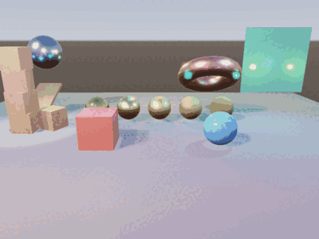
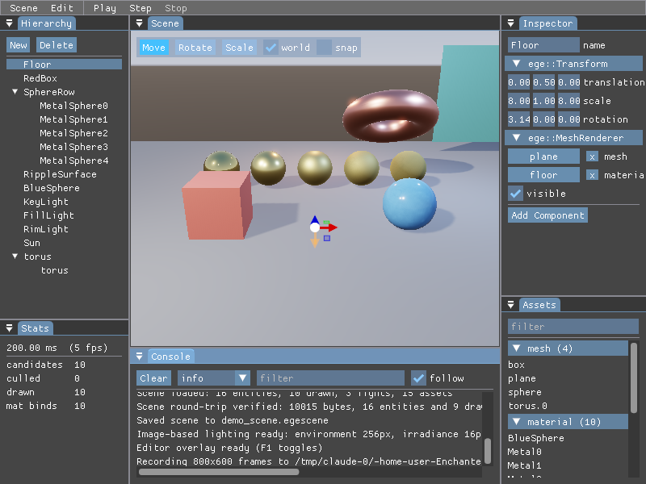

# Enchanted Graphics Engine

A Vulkan game engine in C++17, built from the renderer up.


A Vulkan 1.3 forward renderer — dynamic rendering, a frame graph, a
metallic-roughness PBR pipeline with image-based lighting, shading into a
linear HDR target with an ACES tonemap pass — plus an entity-component
system, runtime reflection, textures with mip generation, a job system and a
fixed-timestep simulation clock.

The image above is the demo scene: five metal spheres sweeping roughness from
near-mirror to fully rough, plus two dielectrics, lit by three point lights
and a low sun under a procedurally generated evening sky. The smoothest metal
reflects that sky — in earlier builds it was nearly black, because a mirror
with no environment to reflect *is* nearly black, and giving it one is
exactly what image-based lighting does. The sun casts real shadows through a
depth-only frame graph pass, and its direction, the disk in the sky and the
shadows all agree because they share one definition. The environment, its
irradiance and prefiltered specular convolutions and the BRDF lookup table
are all computed on the GPU at startup, so a clean checkout still ships no
binary assets.

Scenes save and load as reflection-driven JSON, entities can be parented, and
draws are frustum-culled and sorted by material. Render passes declare what
they read and write; barriers, image layouts and transient render targets are
derived by the frame graph rather than written by hand.

Bright highlights bloom through a half-resolution blur chain, composited in
linear light before the ACES tonemap.

The copper torus is a **glTF import**: any `.gltf`/`.glb` dropped into
`assets/models/` is parsed, its materials and textures built, and its node
hierarchy spawned as entities at startup. The demo's torus is itself a
self-contained text glTF, so the no-binary-assets rule still holds.

The green sheet has no mesh file at all. Its 2 401 vertices are rewritten by a
C++ behaviour every tick and uploaded once a frame — geometry as a script's
output rather than as an asset.

## The demo

```sh
./build/default/bin/EnchantedEngine --demo
```



A scripted camera move through the scene with the editor hidden and the scene
playing. Most of what a renderer does only becomes visible when the camera
moves: a mirror sphere is a coloured ball until its reflection slides across
it, and a shadow is a dark patch until it swings.
[`docs/DEMO.md`](docs/DEMO.md) says what each shot is aimed at. The engine
records its own frames — `--record DIR` writes every one as a PNG, with time
advancing a fixed step per frame so the same recording is the same on any
machine.

## The editor



Press **F1**. The scene renders into an offscreen image the UI samples as a
texture, so it is a **viewport** — a panel with its own aspect ratio, with the
hierarchy, inspector, assets and console docked around it rather than floating
over the picture they describe.

- **Hierarchy** — create, delete and reparent by dragging.
- **Inspector** — generated entirely from the engine's reflection system. A
  component gets editable fields, sliders, colour pickers, asset slots and an
  entry in the add-component list by declaring itself with `EGE_REFLECT`, with
  no inspector code written per type.
- **Gizmos** — translate, rotate and scale, world or local, with snapping.
- **Assets** — everything the project catalogued, draggable into the
  inspector's slots.
- **Play / Pause / Step / Stop** — Play snapshots the world and Stop restores
  it, so running the scene never costs the one you authored.
- **Undo and redo** over every kind of edit, `Ctrl+Z` and `Ctrl+Shift+Z`.

Assets are referenced by a stable id kept in a `.egameta` sidecar, so a
reference survives its file being moved, renamed or reimported — and a saved
scene comes back with its geometry, which is what makes Play/Stop and undo
possible at all.

## Scripting

Behaviour is a C++ class. Subclass `Behavior`, declare its fields with the
same reflection macros a component uses, and register it:

```cpp
class Spinner : public Behavior {
public:
    glm::vec3 anglesPerSecond{0.f, 1.f, 0.f};

    void onFixedTick(float deltaSeconds) override {
        Transform* transform = self().find<Transform>();
        if (transform == nullptr) {
            return;
        }
        transform->rotation += anglesPerSecond * deltaSeconds;
        hierarchy::markDirty(world(), self().id());
    }
};

EGE_REFLECT(Spinner)
EGE_FIELD(anglesPerSecond).tooltip("Radians per second about each axis");
EGE_REFLECT_END()

EGE_BEHAVIOR(Spinner)
```

`EGE_BEHAVIOR` puts it in the registry, so the editor can list it and attach
it by name. `EGE_REFLECT` is what gets its fields into the inspector and into
the scene file — the same reflection that drives component editing, with no
per-behaviour UI or serialization code. Attach as many as you like to one
entity through the `Script` component; `onSpawn`, `onFixedTick`, `onTick` and
`onDespawn` run in the order they were attached, and Play/Stop spawns and
despawns them along with the world snapshot.

A behaviour whose type is not in the running build keeps its saved fields
verbatim instead of dropping them, so opening a scene without the code that
defines a behaviour and saving it again does not quietly erase the setup.

Geometry can be written from a script too. A `DynamicMesh` holds CPU-side
vertices and indices, `recalculateNormals()` rebuilds shading from whatever
the script did to the positions, and `markDirty()` schedules exactly one
upload for the frame however many times the vertices were touched. The demo's
rippling sheet is a script rewriting 2 401 vertices every tick.

**Asset hot reload.** The engine watches the project directory while it runs:
save a change to `assets/materials/floor.egematerial` and the demo's floor
changes without a restart. A material is rewritten inside the object every
holder already points at, so nothing has to re-resolve a reference; meshes and
textures are immutable once uploaded, so those are rebuilt and the world's
references are repointed. A broken edit costs you the edit — the parse failure
is logged and the previous version keeps drawing.

Script hot reload is not here yet, and needs one specific thing:
`Enchanted` is a static library, so a `dlopen`'d script module would get its
own copies of the type, component and behaviour registries and nothing
registered across the boundary would be visible. That is a build change to the
whole project, and it is its own piece of work.

Still to come: cascaded and point-light shadows, anti-aliasing, the standalone
editor application, script hot reload and physics.
[`docs/ROADMAP.md`](docs/ROADMAP.md) lays out the plan and tracks, per phase,
exactly what has landed and what has not.

## Building

You need a C++17 compiler, CMake 3.21 or newer, the Vulkan SDK, and a driver
supporting Vulkan 1.3.
Everything else — GLFW, GLM, doctest — is resolved automatically, preferring
system packages and falling back to a pinned source build.

```sh
cmake --preset default
cmake --build --preset default
./build/default/bin/EnchantedEngine
```

`glslangValidator` must be on `PATH` or in the Vulkan SDK; on Debian and
Ubuntu it is in `glslang-tools`.

### Presets

| Preset    | What it gives you |
|-----------|-------------------|
| `default` | Release |
| `debug`   | Debug, Vulkan validation layers active |
| `asan`    | Debug plus AddressSanitizer and UndefinedBehaviorSanitizer |
| `tsan`    | Debug plus ThreadSanitizer, for the job system |
| `cxx20`   | Release built as C++20 |

Each writes to `build/<preset>/`, so configurations coexist.

### Tests

```sh
ctest --test-dir build/default --output-on-failure
```

The suite covers logic that needs no GPU — primitive geometry, transform
maths, asset ids and cataloguing, scene round-trips, play mode and undo — so
it runs anywhere. Rendering is covered separately by a headless smoke test in
CI, which draws the demo scene under lavapipe with the validation layers
enabled and fails on any validation message.

## Controls

| Key | Action |
|-----|--------|
| `W` `A` `S` `D` | Move |
| `Q` / `E` | Down / up |
| Arrow keys | Look |
| Hold right mouse | Mouse-look (captures the cursor) |
| `F1` | Show or hide the editor |
| `Ctrl+Z` / `Ctrl+Shift+Z` | Undo / redo |

With the editor up, the camera answers only while the cursor is over the
scene view; anywhere else the mouse and keyboard belong to the panels.

## Layout

```
app/            entry point
src/
  core/         application root, logging, assertions, time, job system
  reflect/      runtime type information
  platform/     window and input; everything touching GLFW
  assets/       asset database, stable ids, glTF import (cgltf)
  editor/       in-process panels, the offscreen viewport, play mode and undo;
                these move into EnchantedEditor rather than being rewritten
  rhi/          device, swapchain, pipeline, buffer, descriptors, textures,
                frame graph, frame recording
  render/       renderer, model, camera, materials, lights, bounds,
                environment lighting, PBR, shadows, skybox, bloom and post-process
  scene/        world, entities, component pools, components, hierarchy, serialization
shaders/        GLSL, compiled to SPIR-V into the build tree
assets/         runtime assets, resolved via EGE_ASSET_ROOT
tests/          doctest suite
cmake/          dependency, warning and shader modules
docs/           roadmap and design notes
```

The engine builds as a static library (`Enchanted`, aliased `ege::engine`);
the executable is just `app/main.cpp`. Tests link the library directly, and
the editor and standalone runtime will do the same.

## Conventions

- Types are `PascalCase` in `namespace ege`, files are named after the type
  they declare, and includes are module-qualified: `#include "rhi/Buffer.hpp"`.
- Constructor parameters that would shadow the member they initialise take a
  `Ref` suffix.
- Formatting is enforced by `.clang-format`; CI rejects anything unformatted.
- Warnings are errors on every target. Third-party headers are included as
  `SYSTEM` so they are exempt.

`git config blame.ignoreRevsFile .git-blame-ignore-revs` keeps the tree-wide
reformat out of `git blame`.

## Third-party

| | | |
|---|---|---|
| [Vulkan SDK](https://vulkan.lunarg.com/) | graphics API | system |
| [GLFW](https://www.glfw.org/) 3.4 | windowing and input | fetched or system |
| [GLM](https://github.com/g-truc/glm) 1.0.1 | maths | fetched or system |
| [tinyobjloader](https://github.com/tinyobjloader/tinyobjloader) | OBJ import | vendored |
| [cgltf](https://github.com/jkuhlmann/cgltf) 1.14 | glTF 2.0 import | fetched |
| [Dear ImGui](https://github.com/ocornut/imgui) 1.91.8 (docking) | editor UI | fetched |
| [ImGuizmo](https://github.com/CedricGuillemet/ImGuizmo) | transform gizmos | fetched |
| [spdlog](https://github.com/gabime/spdlog) 1.14.1 | logging | fetched or system |
| [VulkanMemoryAllocator](https://github.com/GPUOpen-LibrariesAndSDKs/VulkanMemoryAllocator) 3.1.0 | GPU memory | fetched |
| [stb_image](https://github.com/nothings/stb) | image decoding | fetched |
| [nlohmann/json](https://github.com/nlohmann/json) 3.11.3 | scene serialization | fetched or system |
| [doctest](https://github.com/doctest/doctest) 2.4.11 | tests | fetched |

The Vulkan buffer abstraction started from Sascha Willems'
[`VulkanBuffer`](https://github.com/SaschaWillems/Vulkan/blob/master/base/VulkanBuffer.h),
and the renderer's foundations follow Brendan Galea's
[Vulkan engine series](https://github.com/blurrypiano/littleVulkanEngine).

## Licence

MIT — see [`LICENSE`](LICENSE). Vendored tinyobjloader is MIT as well; its
notice is in `external/tinyobjectloader/LICENSE`.
