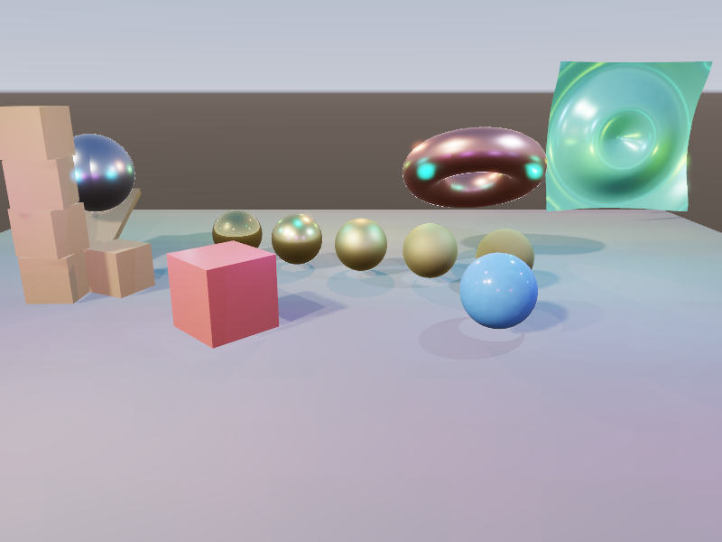

# Enchanted Graphics Engine

A Vulkan game engine in C++17, built from the renderer up.



Right now it is a forward renderer — device and swapchain management, a
graphics pipeline, staged vertex and index buffers, descriptor sets, a
perspective camera, procedural mesh primitives, and per-pixel point lighting.
The scene system, PBR pipeline, editor, C++ scripting and physics are planned;
[`docs/ROADMAP.md`](docs/ROADMAP.md) lays out how it gets there.

## Building

You need a C++17 compiler, CMake 3.21 or newer, and the Vulkan SDK.
Everything else — GLFW, GLM, doctest — is resolved automatically, preferring
system packages and falling back to a pinned source build.

```sh
cmake --preset default
cmake --build --preset default
./build/default/bin/EnchantedEngine
```

`glslangValidator` must be on `PATH` or in the Vulkan SDK; on Debian and
Ubuntu it is in `glslang-tools`.

### Presets

| Preset    | What it gives you |
|-----------|-------------------|
| `default` | Release |
| `debug`   | Debug, Vulkan validation layers active |
| `asan`    | Debug plus AddressSanitizer and UndefinedBehaviorSanitizer |
| `tsan`    | Debug plus ThreadSanitizer, for the job system |
| `cxx20`   | Release built as C++20 |

Each writes to `build/<preset>/`, so configurations coexist.

### Tests

```sh
ctest --test-dir build/default --output-on-failure
```

The suite covers logic that needs no GPU — primitive geometry, transform
maths — so it runs anywhere. Rendering is covered separately by a headless
smoke test in CI, which draws the demo scene under lavapipe with the
validation layers enabled and fails on any validation message.

## Controls

| Key | Action |
|-----|--------|
| `W` `A` `S` `D` | Move |
| `Q` / `E` | Down / up |
| Arrow keys | Look |
| Hold right mouse | Mouse-look (captures the cursor) |

## Layout

```
app/            entry point
src/
  core/         application root, logging, assertions, time, job system
  reflect/      runtime type information
  platform/     window and input; everything touching GLFW
  rhi/          device, swapchain, pipeline, buffer, descriptors
  render/       renderer, model, camera, render systems
  scene/        game objects and transforms
shaders/        GLSL, compiled to SPIR-V into the build tree
assets/         runtime assets, resolved via EGE_ASSET_ROOT
tests/          doctest suite
cmake/          dependency, warning and shader modules
docs/           roadmap and design notes
```

The engine builds as a static library (`Enchanted`, aliased `ege::engine`);
the executable is just `app/main.cpp`. Tests link the library directly, and
the editor and standalone runtime will do the same.

## Conventions

- Types are `PascalCase` in `namespace ege`, files are named after the type
  they declare, and includes are module-qualified: `#include "rhi/Buffer.hpp"`.
- Constructor parameters that would shadow the member they initialise take a
  `Ref` suffix.
- Formatting is enforced by `.clang-format`; CI rejects anything unformatted.
- Warnings are errors on every target. Third-party headers are included as
  `SYSTEM` so they are exempt.

`git config blame.ignoreRevsFile .git-blame-ignore-revs` keeps the tree-wide
reformat out of `git blame`.

## Third-party

| | | |
|---|---|---|
| [Vulkan SDK](https://vulkan.lunarg.com/) | graphics API | system |
| [GLFW](https://www.glfw.org/) 3.4 | windowing and input | fetched or system |
| [GLM](https://github.com/g-truc/glm) 1.0.1 | maths | fetched or system |
| [tinyobjloader](https://github.com/tinyobjloader/tinyobjloader) | OBJ import | vendored |
| [spdlog](https://github.com/gabime/spdlog) 1.14.1 | logging | fetched or system |
| [doctest](https://github.com/doctest/doctest) 2.4.11 | tests | fetched |

The Vulkan buffer abstraction started from Sascha Willems'
[`VulkanBuffer`](https://github.com/SaschaWillems/Vulkan/blob/master/base/VulkanBuffer.h),
and the renderer's foundations follow Brendan Galea's
[Vulkan engine series](https://github.com/blurrypiano/littleVulkanEngine).

## Licence

MIT — see [`LICENSE`](LICENSE). Vendored tinyobjloader is MIT as well; its
notice is in `external/tinyobjectloader/LICENSE`.
